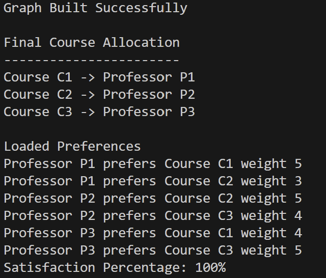
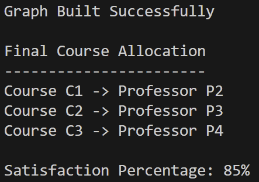

# Course Allotment Optimization System

## Problem
Manual course allocation is inefficient and may not satisfy professor preferences and can lead to inefficient assignments.

## Solution
This project models course allocation as a weighted bipartite matching problem using graph algorithms to maximize satisfaction.

## Features
- Graph-based modeling
- Weighted preference optimization
- Satisfaction percentage calculation
- Modular C++ project structure

## Tech Stack
- C++
- Graph Algorithms
- Optimization Techniques

## Sample Output

## System Architecture

## System Evolution

### Before Machine Learning

### After Machine Learning Integration

## How to Run
# 1.Install Python dependencies (only first time)
pip install pandas scikit-learn joblib
# 2.Train Machine Learning model
cd ml
python train_model.py
cd ..
# 3.Compile C++ program
g++ src/*.cpp -Iinclude -o allot.exe
# 4.Run the program
./allot.exe

